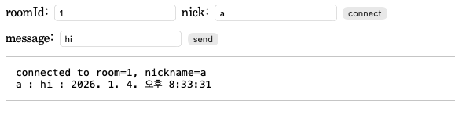

# 코틀린으로 Websocket을 이용하여 채팅 시스템 만들어보기

## WebSocket
- 클라이언트와 서버 간의 양방향 통신을 가능하게 하는 프로토콜

## STOMP - Simple Text Oriented Messaging Protocol
- 텍스트 기반 메시징 프로토콜

### STOMP 구조
- CONNECT : 클라이언트가 서버에 연결 요청
- SEND : 메시지를 특정 목적지로 전송
- SUBSCRIBE : 특정 주제를 구독하여 메시지를 수신
- UNSUBSCRIBE : 구독 해제
- DISCONNECT : 연결 종료

## 동작 방식
- WebSocket은 HTTP 프토콜을 통해 연결을 설정한 후, 지속적인 연결을 유지하면서 데이터를 주고받습니다.
- 반면, STOMP는 WebSocket 연결 위에서 메시지를 전송하는 프로토콜로 메시지의 형식과 라우팅을 정의

  
  
## 차이점
### 프로토콜의 목적
- WebSocket은 연결을 유지하고 양방향 통신을 가능하게 하는 프로토콜
- STOMP는 WebSocket 위에서 메시지를 전송하기 위한 프로토콜
  (STOMP는 PUB/SUB 구조로 작동하며 경로 지정이 가능하고 메시지 세부사항을 명확하게 정의해줄 수 있다)

## 결과

참고 : https://skorea6.tistory.com/entry/%EC%8A%A4%ED%94%84%EB%A7%81-STOMP-%EA%B0%9C%EB%85%90-%EA%B5%AC%EC%A1%B0-%EB%B0%8F-%EC%8B%A4%EC%8B%9C%EA%B0%84-%EA%B8%B0%EB%8A%A5-%EA%B5%AC%ED%98%84-%EC%9B%B9%EC%86%8C%EC%BC%93
